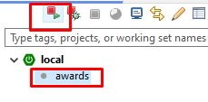

Golden Raspberry Awards
===
Golden Raspberry Awards **Worst Picture** nominees and winners.
## Papar Information
- Title:  `Golden Raspberry Awards`
- Authors:  `Roberto de Carvalho Coelho`
- Preprint: [http://localhost:8080/api/winners]()


## Install & Dependence
- java 17
- Spring Boot 3.3.2
- h2 database
- lombok https://projectlombok.org/download

## Webapp Example
- Run the following command
  ```
  mvn jetty:run
  ```
- Run the following command with specific port 8888
  ```
  mvn -Djetty.port=8888 jetty:run
  ```
  - for ECLIPSE 



## Code Details
### Tested Platform
- Run the following command
  ```
  mvn clean test  
  ```


## Directory Hierarchy
```
|—— .classpath
|—— .factorypath
|—— .gitignore
|—— HELP.md
|—— pom.xml
|—— src
|    |—— main
|        |—— java
|            |—— outserra
|                |—— awards
|                    |—— adapter
|                        |—— movie
|                            |—— MovieRepository.java
|                            |—— WinnerController.java
|                    |—— ApplicationAfterStartup.java
|                    |—— AwardsApplication.java
|                    |—— core
|                        |—— movie
|                            |—— application
|                                |—— loadcsv
|                                    |—— LoadCSVService.java
|                                    |—— LoadCSVUseCase.java
|                                |—— lookforwinnerrange
|                                    |—— LookForWinnerRangeService.java
|                                    |—— LookForWinnerRangeUseCase.java
|                            |—— domain
|                                |—— Movie.java
|                    |—— ServletInitializer.java
|                    |—— shared
|                        |—— UsecaseBase.java
|        |—— resources
|            |—— application-dev.properties
|            |—— application.properties
|            |—— db
|            |—— lombok.config
|            |—— movielist (7).csv
|            |—— static
|            |—— templates
|        |—— webapp
|    |—— test
|        |—— java
|            |—— outserra
|                |—— awards
|                    |—— AbstractIntegrationTest.java
|                    |—— adapter
|                        |—— movie
|                            |—— WinnerControllerTest.java
|                    |—— AwardsApplicationTests.java
|                    |—— core
|                        |—— movie
|                            |—— application
|                                |—— loadcsv
|                                    |—— LoadCSVUseCaseTest.java

```

